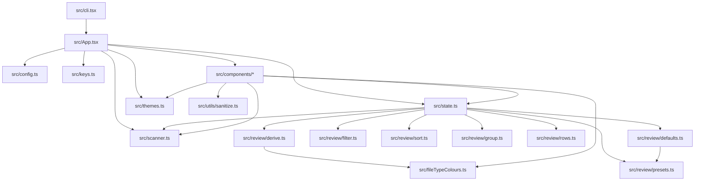
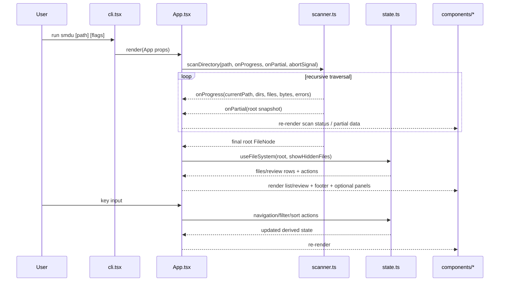
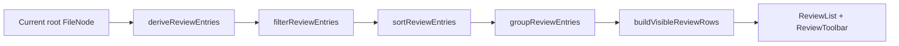

# smdu Architecture Deconstruction

This document deconstructs `smdu` as implemented in `src/` on March 9, 2026.

## Visual Map


## 1) System Overview

`smdu` is a terminal UI application with a single-process architecture:

- **CLI adapter** parses flags and boots the app (`src/cli.tsx`).
- **Application orchestrator** owns runtime lifecycle, scan control, and input routing (`src/App.tsx`).
- **Domain/state layer** manages browse/review state transitions and derived datasets (`src/state.ts`, `src/review/*`).
- **Scan engine** builds the in-memory filesystem tree (`src/scanner.ts`).
- **Presentation layer** renders Ink components for list, review, overlays, status, and settings (`src/components/*`).
- **Cross-cutting support** provides theme, keys, config persistence, sanitisation, and file-type categorisation (`src/themes.ts`, `src/keys.ts`, `src/config.ts`, `src/utils/sanitize.ts`, `src/fileTypeColours.ts`).

### 1.1 Architecture classification

`smdu` is best classified as a **modular layered monolith** with an **event-driven UI loop**:

- **Monolith**: one process, one deployable CLI binary.
- **Layered**: CLI adapter -> orchestration -> domain/scan -> presentation.
- **Event-driven/reactive**: keyboard input, scan callbacks, and resize events trigger state changes and re-rendering.
- **Pipeline sub-architecture** in Review mode: derive -> filter -> sort -> group -> visible rows.

### ASCII Layered View

```text
+------------------------------------------------------------------+
| User Terminal                                                    |
|   keyboard input + TTY resize + alternate screen buffer          |
+------------------------------+-----------------------------------+
                               |
                               v
+------------------------------------------------------------------+
| CLI Adapter (src/cli.tsx)                                        |
|   commander args -> render(<App />) -> optional alt buffer       |
+------------------------------+-----------------------------------+
                               |
                               v
+------------------------------------------------------------------+
| App Orchestrator (src/App.tsx)                                   |
|   lifecycle, scan start/stop, progress, input gating, overlays   |
+-------------------+----------------------------+-----------------+
                    |                            |
                    v                            v
+----------------------------------+   +---------------------------+
| Scan Engine (src/scanner.ts)     |   | Domain State (src/state.ts)|
|   fs recursion + concurrency      |   | selection, mode, sort,     |
|   progress + partial snapshots    |   | review state + actions     |
+-------------------+--------------+   +---------------------------+
                    |                            |
                    +-------------+--------------+
                                  v
+------------------------------------------------------------------+
| Ink Presentation (src/components/*)                              |
|   Header/Footer/FileList/ReviewList/StatusPanel/Modals           |
+------------------------------------------------------------------+
```

## 2) Module Dependency Graph



## 3) Runtime Behaviour

### 3.1 Startup and scan lifecycle

1. `cli.tsx` parses path/theme/units/fullscreen.
2. If TTY + fullscreen, alternate screen buffer is enabled.
3. `render(<App .../>)` mounts the main Ink tree.
4. `App` resolves theme/units from CLI override then config defaults.
5. `App` starts a scan (`scanDirectory`) with:
   - throttled progress updates (about every 80ms),
   - incremental partial tree updates (batched about every 100ms),
   - cancellation via `AbortController`.
6. During scan, UI stays interactive for quit/cancel and displays current path + counters.
7. When scan completes, root tree is committed and browse/review views become active.

### 3.2 Sequence diagram



### 3.3 Terminal I/O and event model (split document)

The detailed terminal read/write and event lifecycle design now lives in:

- `docs/architecture/smdu_terminal_io_event_model.md`

That document includes:

- dedicated diagrams for event generation, runtime boundaries, and output protocol flow
- full read/write path descriptions (stdin raw mode through ANSI write diff)
- control sequence catalogue (`CSI ?1049h`, `CSI ?1049l`, `BEL`, cursor/erase operations)
- notes on bells and whistles, including current window-title behaviour
- concrete end-to-end traces for resize, keypress, and timer completion

## 4) Scan Engine Deconstruction (`src/scanner.ts`)

Core design decisions:

- **File model**: each node is a `FileNode` with metadata, size, file counts, and `parent` pointer.
- **Traversal strategy**: async recursion with `Promise.all` over directory entries.
- **Concurrency guard**: internal `pLimit(64)` with an O(1) linked-list queue to avoid `queue.shift()` overhead.
- **Progress semantics**:
  - increments directory/file counters during traversal,
  - tracks current path and accumulated bytes,
  - increments error count on unreadable directories.
- **Resilience**:
  - graceful handling of unreadable directories,
  - explicit `ScanCancelledError` for cancellation path,
  - symbolic link metadata capture with broken-link reporting.

### Scan data model (simplified)

```text
FileNode
|- name, path
|- isDirectory, isSymbolicLink, isBrokenSymbolicLink
|- size, fileCount
|- mode, birthtime, mtime
|- isHidden
|- linkTarget, linkError
|- parent: FileNode?
`- children: FileNode[]?
```

## 5) State and View Deconstruction (`src/state.ts`)

`useFileSystem` acts as the local state engine between raw scan tree and rendered rows.

### Responsibilities

- Track **current node**, selection index, sort field/order, and active view mode (`flat`, `tree`, `review`).
- Keep node references stable across partial scan updates via path-based re-resolution (`findNodeByPath`).
- Produce browse lists:
  - flat mode: immediate children
  - tree mode: flattened depth-first expansion
- Maintain per-root review state (`reviewStateByRoot`) so review filters/presets survive intra-tree navigation.
- Provide imperative actions used by `App` input routing:
  - movement, enter/go-up,
  - sort/view toggles,
  - review preset/group/scope/filter cycles,
  - delete selected item,
  - open review-selected item in browse mode.

### Review pipeline



Pipeline traits:

- Fully derived via `useMemo` stages.
- Filters include scope, min size, age bucket, extension/type, path prefix, hidden, media-only, source root.
- Sorting is stable with path/index fallback.
- Group rows and entry rows are merged into a single visible-row stream for navigation.

## 6) App Orchestration Deconstruction (`src/App.tsx`)

`App` is the integration centre. It coordinates:

- scan lifecycle and progress UI,
- keybinding precedence and modal gating,
- timer feature and stats,
- right-side status panel and metadata fetch,
- config-backed preferences (theme, units, hidden files, heatmap, file type colours).

### Input handling order (high level)

```text
if modal open (help/info/review-filters) -> only close commands
else if loading/scanning -> only quit/cancel
else if settings view -> settings handles interaction
else if confirm delete -> y confirms, any other key cancels
else -> normal navigation + mode-specific actions
```

This strict ordering prevents command collisions and keeps behaviour predictable.

## 7) Presentation Deconstruction (`src/components/*`)

Component groups:

- **Structural shell**: `Header`, `Footer`, `StatusBanner`.
- **Browse views**: `FileList` (flat/tree with usage bar + optional heatmap).
- **Review views**: `ReviewToolbar`, `ReviewList`, `ReviewFiltersModal`.
- **Context panels/modals**: `StatusPanel`, `Settings`, `HelpModal`, `InfoModal`, `ConfirmDelete`.
- **Runtime indicators**: `ScanStatus`, `TimerStatus`.

Notable UI mechanics:

- Most list/panel components subscribe to stdout resize to keep column/row budgets accurate.
- `FileList` and `ReviewList` implement windowed rendering against terminal height.
- Colour decisions are centralised via theme tokens plus file-type category mapping.

## 8) Persistence and External Interfaces

- **Configuration**: `conf` store (`src/config.ts`) persists theme, units, hidden visibility, heatmap, and file-type colour toggles.
- **Filesystem API**: Node `fs.promises` for scan, metadata, and deletion.
- **CLI framework**: `commander` for argument parsing.
- **Rendering runtime**: Ink + React hooks for terminal UI.

## 9) Architectural Strengths

- Clean separation between scanning, derivation, orchestration, and presentation.
- Strong incremental scan UX via progress + partial snapshots.
- Review mode is composable and mostly pure-function driven (`src/review/*`).
- Keybinding model is centralised in `src/keys.ts`.

## 10) Architectural Pressure Points

- `App.tsx` is a high-responsibility integration hub and may become harder to evolve without feature slicing.
- `FileNode` parent pointers create cyclic object graphs; this is useful for navigation but can increase memory pressure on very large scans.
- Scan recursion still depends on deep async traversal patterns; extremely deep trees may stress stack/runtime in edge cases.
- Input handling logic is central and long; regressions are possible when adding mode-specific shortcuts.

## 11) Suggested Evolution Seams

- Extract `App` input routing into a dedicated command dispatcher per view state.
- Split scan lifecycle state into a custom hook (`useScanController`) to reduce `App` surface area.
- Introduce a `view-model` layer for browse/review rows to decouple presentation width logic from domain state.
- Add explicit architecture tests around key precedence and review pipeline invariants.
