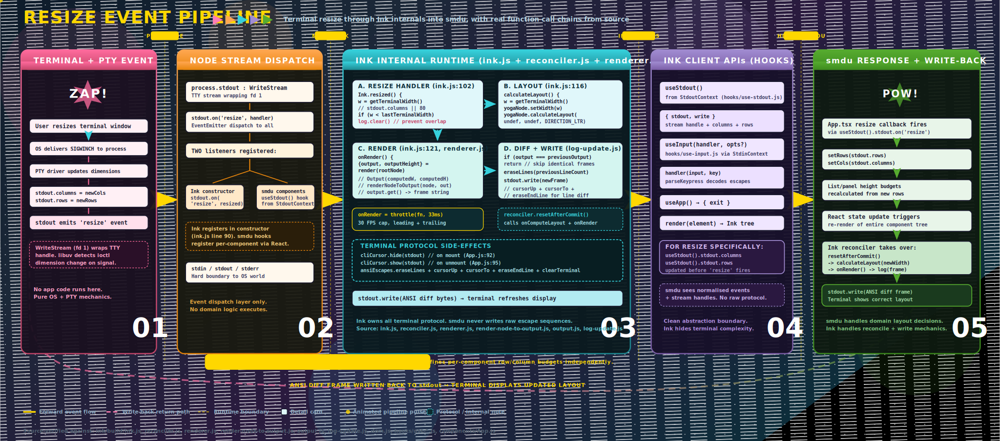
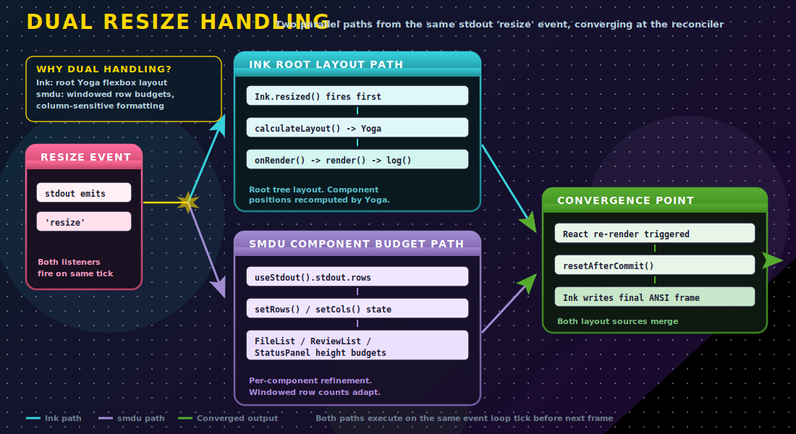

# The Resize Event Pipeline: What Ink Does Between Terminal and smdu

This paper is a companion to the resize event pipeline SVG. It traces a single terminal resize event from the moment a user drags a window edge through every layer of the runtime stack, explaining what happens at each boundary, which code owns which responsibility, and why the architecture works the way it does.

Every function name, line reference, and call chain in this document has been verified against the Ink source files in `node_modules/ink/build/`.

## Visual Overview

[Open SVG: resize event pipeline](./smdu_ink_event_pipeline.svg)



---

## 1) The Signal Chain: Terminal to Node.js

[Open SVG: PTY signal chain](./smdu_pty_signal_chain.svg)


A resize event begins entirely outside Node.js. The path from user action to application code crosses four distinct boundaries before any JavaScript executes.

### 1.1 User action

The user resizes a terminal window. This can happen through direct mouse interaction (dragging a window edge), a window manager tiling operation, a tmux pane resize, or an SSH remote terminal dimension change. The terminal emulator detects the new pixel dimensions and maps them to a character grid (columns and rows).

### 1.2 Kernel signal delivery

The terminal emulator calls `ioctl(fd, TIOCSWINSZ, &winsize)` on the PTY master file descriptor, updating the kernel's stored window size for the slave TTY device. The kernel then delivers `SIGWINCH` (signal 28 on Linux) to the foreground process group of the terminal session.

This is a POSIX mechanism. It is not specific to Node.js, Ink, or any application framework. Any process attached to the TTY receives this signal.

### 1.3 libuv event loop integration

Node.js uses libuv for its event loop. libuv registers a signal handler for `SIGWINCH` via `uv_signal_start()`. When the signal arrives, libuv wakes the event loop and fires the registered callback on the next iteration. This is non-blocking and integrates cleanly with Node's single-threaded execution model.

The TTY `ReadStream` implementation in Node.js then queries the updated terminal dimensions from the kernel.

### 1.4 WriteStream property update and event emission

`process.stdout` is a `WriteStream` instance wrapping file descriptor 1. When the signal callback fires, Node.js:

1. Updates `stdout.columns` to the new column count.
2. Updates `stdout.rows` to the new row count.
3. Emits the `'resize'` event on the stream.

A critical detail: the dimension properties are updated **before** the event fires. This means any listener reading `stdout.columns` or `stdout.rows` in its callback handler will see the new values immediately.

---

## 2) The Node Stream Boundary: Event Dispatch

The `stdout` stream is a standard Node.js `EventEmitter`. When it emits `'resize'`, it synchronously calls all registered listeners in registration order on the same event loop tick.

### 2.1 Two listeners

In the running `smdu` application, two distinct listeners receive this event:

**Ink's internal handler**, registered during the Ink class constructor (`ink.js` line 90):

```
options.stdout.on('resize', this.resized)
```

This registration happens once, when `render()` is first called. The handler is stored as `this.unsubscribeResize` for cleanup during unmount.

**smdu component handlers**, registered through Ink's `useStdout()` hook. Components like `App.tsx`, `FileList`, `ReviewList`, and `StatusPanel` access `stdout` via `useStdout()` which reads from Ink's `StdoutContext`. These components register their own resize listeners through React effect hooks to track terminal dimensions for layout budgeting.

### 2.2 Registration order

Ink's listener is always registered first because it is set up in the Ink class constructor, before any React component mounts. `smdu` component listeners register later, during React component mount via `useEffect`. Both execute on the same event loop tick when the resize event fires.

### 2.3 What this boundary represents

The `stdout` stream is the hard runtime boundary between the operating system's terminal subsystem and the JavaScript application stack. Below this boundary, everything is kernel signals, PTY drivers, and libuv event loop integration. Above this boundary, everything is JavaScript event dispatch and React component lifecycle.

No domain logic executes at this layer. It is purely event routing.

---

## 3) Ink Internal Runtime: The Four-Stage Pipeline

[Open SVG: Ink render stages](./smdu_ink_render_stages.svg)


This is the most complex part of the pipeline. Ink performs four distinct stages to transform a resize event into updated terminal output. Each stage is a concrete function call with specific responsibilities.

### 3.1 Stage A: Resize handler (`ink.js` lines 102-112)

The entry point is `Ink.resized()`, the callback registered on `stdout`:

```javascript
resized() {
  const terminalWidth = this.getTerminalWidth();
  // getTerminalWidth returns stdout.columns || 80

  if (terminalWidth < this.lastTerminalWidth) {
    this.log.clear();
  }

  this.calculateLayout();
  this.onRender();
  this.lastTerminalWidth = terminalWidth;
}
```

The width-shrink guard is important. When the terminal gets narrower, Ink calls `this.log.clear()` which erases all previously written output lines. This prevents stale content from the wider layout overlapping with the new narrower frame. Without this guard, shrinking a terminal would produce visual corruption.

`this.lastTerminalWidth` is compared on each resize to detect direction. It is updated at the end, after the full render cycle completes.

### 3.2 Stage B: Layout engine (`ink.js` lines 116-120)

```javascript
calculateLayout() {
  const terminalWidth = this.getTerminalWidth();
  this.rootNode.yogaNode.setWidth(terminalWidth);
  this.rootNode.yogaNode.calculateLayout(
    undefined, undefined, Yoga.DIRECTION_LTR
  );
}
```

Ink uses Facebook's Yoga layout engine (the same flexbox implementation used by React Native). The root Yoga node's width is set to the new terminal width, then `calculateLayout()` traverses the entire component tree computing:

- `getComputedWidth()` and `getComputedHeight()` for every node
- `getComputedLeft()` and `getComputedTop()` for positioning relative to parent
- Border measurements via `getComputedBorder(Yoga.EDGE_*)`
- Display visibility via `getDisplay()`

Each Ink component node gets a corresponding Yoga node created in `dom.js` (line 5-20) via `Yoga.Node.create()`. Text nodes receive a measurement function (`setMeasureFunc(measureTextNode)`) that Yoga uses to determine intrinsic text dimensions.

Style properties are applied through `applyStyles()` which maps Ink component props to Yoga calls: `setFlexGrow()`, `setFlexShrink()`, `setFlexDirection()`, `setAlignItems()`, `setJustifyContent()`, `setMargin()`, `setPadding()`, and more.

### 3.3 Stage C: Render and output materialisation

The render stage spans several files and produces a string frame from the laid-out component tree.

**Entry: `onRender()`** (`ink.js` line 121)

```javascript
onRender() {
  if (this.isUnmounted) return;

  const { output, outputHeight, staticOutput } =
    render(this.rootNode, this.isScreenReaderEnabled);
  // ...
}
```

The `onRender` method is throttled at 30 FPS by default:

```javascript
const maxFps = options.maxFps ?? 30;
const renderThrottleMs = maxFps > 0 ? Math.ceil(1000 / maxFps) : 0;
this.rootNode.onRender = throttle(this.onRender, renderThrottleMs, {
  leading: true,
  trailing: true
});
```

`leading: true` means the first call executes immediately. `trailing: true` means if additional calls arrive during the throttle window, one final call executes after the window closes. This ensures resize events are never silently dropped.

**Renderer: `render()`** (`renderer.js` lines 3-53)

```javascript
render(node, isScreenReaderEnabled) {
  const output = new Output(
    node.yogaNode.getComputedWidth(),
    node.yogaNode.getComputedHeight()
  );
  renderNodeToOutput(node, output, { skipStaticElements: true });
  // ... static output handling ...
  return { output, outputHeight, staticOutput };
}
```

The `Output` class (`output.js`) represents a 2D character buffer. It is initialised with the computed width and height from Yoga layout.

**Tree walk: `renderNodeToOutput()`** (`render-node-to-output.js`)

This function recursively walks the Ink component tree. For each node it:

1. Reads computed position from Yoga: `getComputedLeft()`, `getComputedTop()`
2. Reads computed dimensions: `getComputedWidth()`, `getComputedHeight()`
3. Checks visibility: `yogaNode.getDisplay() !== Yoga.DISPLAY_NONE`
4. Applies clipping regions based on parent boundaries
5. For text nodes: calls `squashTextNodes()` to collect text content, then `output.write(x, y, text, { transformers })`
6. For container nodes: applies background fills and border rendering

**Frame materialisation: `output.get()`** (`output.js`)

The `get()` method transforms all queued write operations into a final string:

1. Initialises a 2D character grid (height rows * width columns)
2. Processes all operations sequentially, placing characters at their computed positions
3. Applies clip regions that were pushed with `output.clip()`
4. Applies text transformers (colour functions) to text lines
5. Tokenises and colourises text via `@alcalzone/ansi-tokenize`
6. Handles multi-width characters (emoji and CJK glyphs)
7. Returns the complete frame as a string

### 3.4 Stage D: Output diffing and terminal write (`log-update.js`)

The final stage minimises terminal I/O by computing the difference between the new frame and the previous one.

**Standard mode** (`createStandard`, lines 3-39):

```javascript
// Simplified logic:
if (output === previousOutput) return;  // skip identical frames
eraseLines(previousLineCount);
stdout.write(output + '\n');
previousOutput = output;
previousLineCount = countLines(output);
```

**Incremental mode** (`createIncremental`, lines 40-110):

For better performance, Ink can use incremental line-by-line diffing:

1. Split both the new and previous output into line arrays
2. If line count decreased, erase the extra lines and move the cursor up
3. For each line in the new output:
   - If the line is identical to the corresponding previous line, skip it (just move the cursor down)
   - If the line changed, position the cursor at the start of that line, write the new content, and erase to end of line
4. Update tracked state for the next frame

The ANSI escape sequences used are:

- `ansiEscapes.eraseLines(count)` — erase N lines above the cursor
- `ansiEscapes.cursorUp(count)` — move cursor up N lines
- `ansiEscapes.cursorTo(column)` — position cursor at a specific column
- `ansiEscapes.cursorNextLine` — move to the next line
- `ansiEscapes.eraseEndLine` — erase from cursor position to end of line
- `ansiEscapes.clearTerminal` — full terminal clear (edge case: output exceeds terminal rows)

**Cursor management:**

Ink hides the cursor during active rendering and shows it on teardown:

- `cliCursor.hide(stdout)` — called in `App.componentDidMount` (`App.js` line 92)
- `cliCursor.show(stdout)` — called in `App.componentWillUnmount` (`App.js` line 95)

### 3.5 Protocol side-effects summary

During the entire resize-to-render cycle, Ink may emit these control sequences to `stdout`:

| Sequence | When | Purpose |
|----------|------|---------|
| `eraseLines(N)` | Every frame | Clear previous output before writing new |
| `cursorUp(N)` | Every frame | Position cursor for line-level updates |
| `cursorTo(col)` | Incremental mode | Position within a line |
| `cursorNextLine` | Incremental mode | Advance to next line |
| `eraseEndLine` | Incremental mode | Clear trailing stale content |
| `clearTerminal` | Edge case | Full reset when output exceeds rows |
| `cliCursor.hide/show` | Mount/unmount | Prevent cursor flicker during renders |

`smdu` does not emit any of these. Ink owns all terminal protocol mechanics.

### 3.6 The reconciler path

There is a second entry into this pipeline. When `smdu` components update their React state (for example, setting new row/column values), React triggers a commit. The Ink reconciler's `resetAfterCommit()` hook (`reconciler.js` lines 71-87) then calls:

1. `rootNode.onComputeLayout()` — which is `calculateLayout()` (Stage B)
2. `rootNode.onRender()` — which is the throttled `onRender()` (Stage C + D)

This means the same layout and render pipeline handles both Ink-initiated resizes and `smdu`-initiated state changes. The pipeline is shared infrastructure.

---

## 4) Ink Client APIs: The Abstraction Boundary

Between Ink's internal runtime and `smdu`'s application code sits a clean API boundary implemented as React hooks and context providers.

### 4.1 useStdout()

```javascript
const { stdout, write } = useStdout();
```

Source: `hooks/use-stdout.js`, reads from `StdoutContext`.

Provides direct access to the `stdout` stream and a `write()` function. For resize handling, `smdu` components read `stdout.columns` and `stdout.rows` to compute layout budgets.

### 4.2 useInput()

```javascript
useInput((input, key) => { /* handler */ }, { isActive });
```

Source: `hooks/use-input.js`, reads from `StdinContext`.

Not directly involved in resize handling, but part of the same API surface. Ink's `parseKeypress()` function decodes raw terminal escape sequences into normalised key objects with properties like `upArrow`, `downArrow`, `return`, `escape`, `ctrl`, `shift`, and `meta`.

### 4.3 useApp()

```javascript
const { exit } = useApp();
```

Source: `hooks/use-app.js`, reads from `AppContext`.

Provides the `exit()` function for unmounting the Ink application.

### 4.4 render()

```javascript
render(element);
```

Source: `render.js`.

The top-level function that creates the Ink instance, sets up the React reconciler container, and mounts the component tree. This is called once by `cli.tsx` at startup.

### 4.5 What smdu does not see

Through this API boundary, `smdu` receives:

- **Normalised events**: parsed key objects, stream dimension properties
- **Stream handles**: `stdout` for dimension reading, `write()` for direct output (used sparingly)
- **Lifecycle control**: `exit()` for clean shutdown

`smdu` does **not** see or interact with:

- Raw terminal escape sequences
- Yoga layout nodes or computed positions
- The `Output` buffer or frame materialisation
- ANSI diff logic or cursor management
- The reconciler commit cycle

This is a deliberate architectural boundary. Ink handles terminal protocol complexity so that `smdu` can focus on domain behaviour.

---

## 5) smdu Response Behaviour

When the resize event reaches `smdu` through the `useStdout()` hook, the application responds with domain-level layout adjustments.

### 5.1 State updates in App.tsx

`App.tsx` registers a resize listener via `useStdout()`:

```javascript
const { stdout } = useStdout();

useEffect(() => {
  const handler = () => {
    setRows(stdout.rows);
    setCols(stdout.columns);
  };
  stdout.on('resize', handler);
  return () => stdout.off('resize', handler);
}, [stdout]);
```

The `rows` and `columns` state values are used throughout the component tree to compute:

- **List height budgets**: how many file entries or review rows fit on screen
- **Panel widths**: how wide the status panel or metadata display can be
- **Windowed rendering**: which slice of a long list to actually render

### 5.2 Component-level refinement

Several `smdu` components independently use terminal dimensions:

- `FileList` computes visible row count from available height minus header/footer
- `ReviewList` does the same for review mode rows
- `StatusPanel` adjusts metadata display density based on available width
- `Header` and `Footer` adapt content truncation to terminal width

### 5.3 React re-render and reconciler handoff

When `smdu` calls `setRows()` or `setCols()`, React schedules a re-render. On the next commit, Ink's reconciler `resetAfterCommit()` fires, which re-enters the Ink pipeline at Stage B (layout) and Stage C+D (render + diff). The updated component tree, now reflecting the new terminal dimensions in its layout budgets, produces a new frame that Ink writes to the terminal.

---

## 6) Dual Resize Handling

[Open SVG: dual resize paths](./smdu_dual_resize_paths.svg)



A distinctive feature of this architecture is that resize events trigger two parallel handling paths from the same event.

### 6.1 Ink's path

Ink's `resized()` handler fires first (registered in the constructor, before any React component mounts). It runs `calculateLayout()` and `onRender()` immediately, producing a new frame based on the component tree's current state at the new terminal width.

### 6.2 smdu's path

`smdu` component resize handlers fire next. They update React state (`setRows`, `setCols`), which schedules a new render. When that render commits, the reconciler re-enters the Ink pipeline, producing another frame with the updated layout budgets.

### 6.3 Why both paths exist

These paths serve different purposes:

- **Ink's path** handles root-level flexbox layout. Yoga recomputes positions and dimensions for every node in the component tree. This is structural: it determines where each component appears on screen.
- **smdu's path** handles domain-level layout refinement. The number of visible list rows, the width available for file name display, the decision to show or hide optional UI elements — these are application-level concerns that Ink's flexbox engine cannot determine on its own.

### 6.4 Convergence

Both paths converge at the reconciler. The final frame written to the terminal reflects both Ink's structural layout and `smdu`'s domain-level budgets. Because Ink's render is throttled at 30 FPS with `leading: true, trailing: true`, rapid resizes are coalesced and only the final state is rendered.

---

## 7) The Return Path: Write-Back to Terminal

The pipeline is not one-directional. After all processing, bytes flow back to the terminal through `stdout.write()`.

### 7.1 What gets written

The final output is an ANSI-encoded string containing:

- Text content with colour and style escape sequences
- Cursor positioning sequences for incremental updates
- Erase sequences to clear stale content
- The complete visual frame of the `smdu` interface

### 7.2 What the user sees

From the user's perspective, the terminal UI redraws at the new size. The file list shows more or fewer rows. The header and footer fill the new width. The status panel adjusts its layout. If the terminal shrank, the frame is cleanly redrawn without visual artefacts thanks to Ink's width-shrink guard in `resized()`.

### 7.3 Performance characteristics

- The throttle at 30 FPS means at most one frame every ~33ms
- Identical frames are skipped entirely (string equality check in log-update)
- Incremental mode writes only changed lines, minimising bytes to the terminal
- The width-shrink `log.clear()` is the most expensive operation, as it erases all previous output

---

## 8) Architectural Implications

### 8.1 Separation of concerns

The resize pipeline demonstrates clean separation across the stack:

| Layer | Responsibility | Owner |
|-------|---------------|-------|
| OS/PTY | Signal delivery, dimension tracking | Kernel |
| Node.js | Stream events, EventEmitter dispatch | Runtime |
| Ink runtime | Layout, render, diff, terminal protocol | Ink |
| Ink hooks | API abstraction, context providers | Ink |
| smdu | Domain layout budgets, state management | Application |

### 8.2 Protocol safety

Because `smdu` never writes raw escape sequences (with the exception of alternate screen buffer control in `cli.tsx` and timer bell), there is no risk of protocol-level bugs in the application layer corrupting terminal state. Ink is the single owner of cursor management, erase operations, and frame diffing.

### 8.3 Testability

The dual-path architecture means resize behaviour can be tested at multiple levels:

- Yoga layout correctness can be validated independently
- `smdu` component budgets can be tested by mocking `stdout.rows` and `stdout.columns`
- The full pipeline can be exercised through integration tests that resize the terminal and verify rendered output

---

## 9) Source Files Reference

### Ink internal files

| File | Role |
|------|------|
| `ink/build/ink.js` | Ink class: resize handler, layout, render orchestration |
| `ink/build/reconciler.js` | React reconciler: `resetAfterCommit`, node lifecycle |
| `ink/build/renderer.js` | Render entry: creates Output, calls renderNodeToOutput |
| `ink/build/render-node-to-output.js` | Tree walker: Yoga positions to Output writes |
| `ink/build/output.js` | Output class: 2D buffer, clip, get() materialisation |
| `ink/build/log-update.js` | Diff engine: standard and incremental modes |
| `ink/build/dom.js` | Node factory: Yoga node creation, tree manipulation |
| `ink/build/components/App.js` | Root component: cursor, raw mode, input reading |
| `ink/build/hooks/use-stdout.js` | Hook: StdoutContext access |
| `ink/build/hooks/use-input.js` | Hook: input parsing and dispatch |
| `ink/build/hooks/use-app.js` | Hook: exit control |

### smdu application files

| File | Role |
|------|------|
| `src/cli.tsx` | Entry point: alternate screen, render() call |
| `src/App.tsx` | Orchestrator: resize listener, state management |
| `src/state.ts` | State engine: useFileSystem hook |
| `src/components/*` | Presentation: layout-sensitive rendering |
