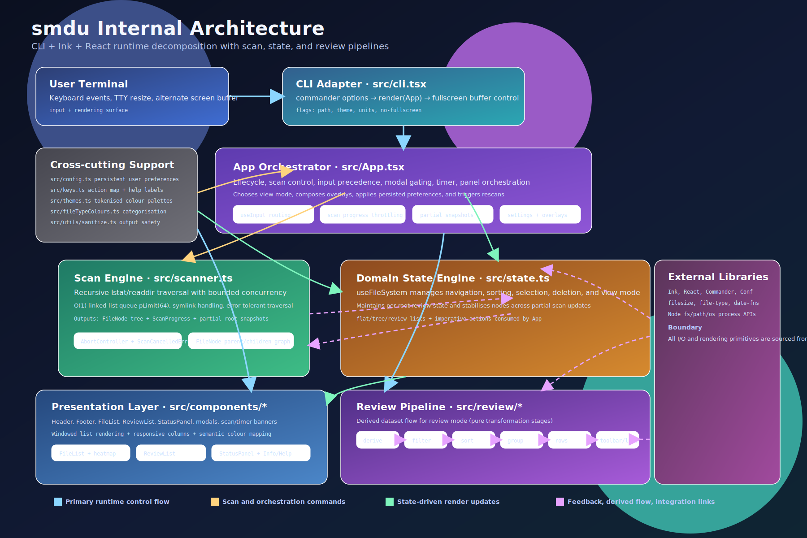
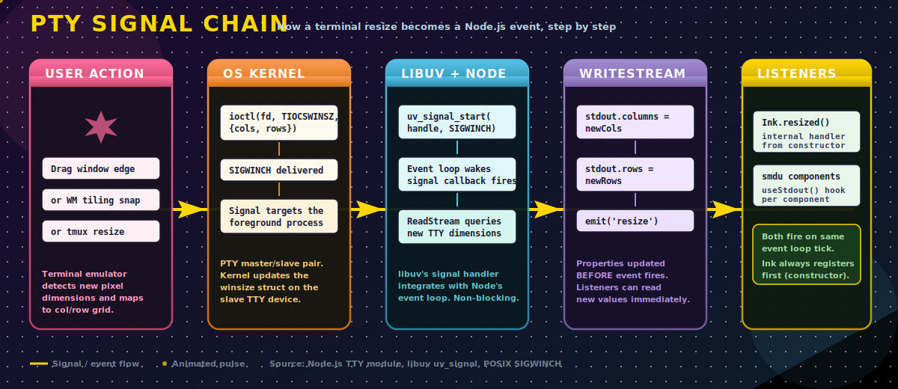
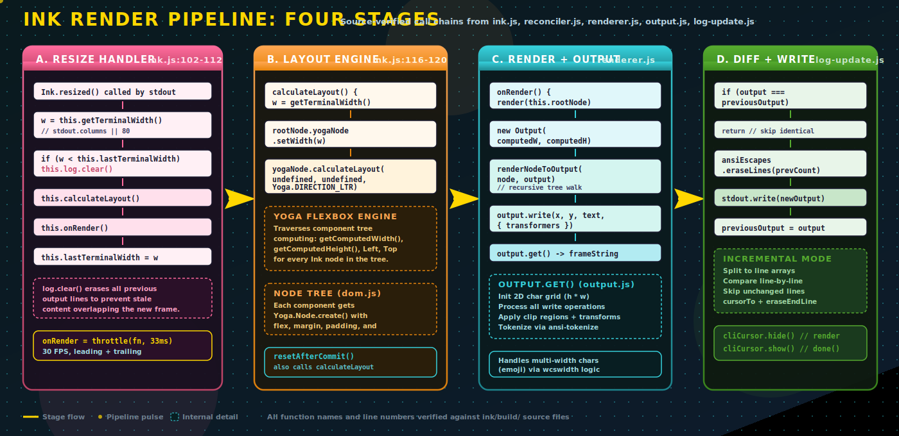
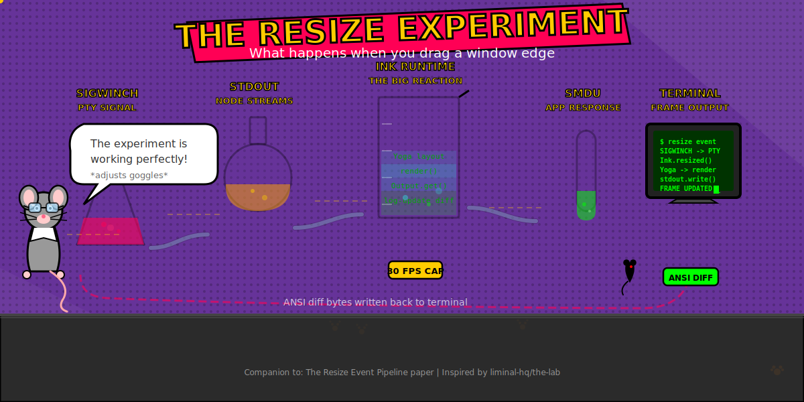

# smdu SVG Prompt Gallery

This gallery tracks the design prompts used to create SVG architecture visuals.

## Internal Architecture

[Open SVG: internal architecture](./images/smdu_internal_architecture.svg)

[](./images/smdu_internal_architecture.svg)

**Prompt**

```text
Create a detailed, colourful SVG architecture map for smdu.

Show the major runtime layers and relationships:
- terminal and user interaction surface
- CLI entrypoint
- App orchestration
- scanner engine
- state engine
- review pipeline
- presentation layer
- external dependencies

Style direction:
- bold, intentional colour system
- strong visual hierarchy
- labelled data/control flow arrows
- modern technical illustration with high readability
```

## Terminal Event Lifecycle

[Open SVG: terminal event lifecycle](./images/smdu_terminal_event_lifecycle.svg)

[](./images/smdu_terminal_event_lifecycle.svg)

**Prompt**

```text
Redesign the terminal event lifecycle SVG in a fun marker style.

Requirements:
- hand-drawn marker-like outer border paths
- richer colourful background fields
- subtle ambient animation in the background
- clear left-to-right event flow sections:
  terminal generation -> Node boundary -> Ink runtime -> smdu logic -> terminal output
- include boundary callouts and protocol side-effect notes

Mood:
- playful technical comic energy
- expressive but still easy to read
```

## Terminal Protocol Surface

[Open SVG: terminal protocol surface](./images/smdu_terminal_protocol_surface.svg)

[](./images/smdu_terminal_protocol_surface.svg)

**Prompt**

```text
Create a colourful protocol-surface SVG for smdu terminal I/O.

Must visualise:
- read side: stdin bytes -> Ink parsing -> client callback
- write side: React commit -> Ink render -> ANSI diff write
- control-sequence side effects:
  alternate screen enter/leave, bell, cursor operations, erase operations
- note current window-title behaviour status

Style:
- marker/hand-drawn framing
- bright layered backgrounds with motion
- comic-inspired callouts and sequence clarity
```

## Event Constellation

[Open SVG: event constellation](./images/smdu_terminal_event_constellation.svg)

[](./images/smdu_terminal_event_constellation.svg)

**Prompt**

```text
Create an extra motif diagram inspired by the meaning of the architecture:
an event constellation.

Concept:
- events as stars
- Ink and smdu as central planets/core nodes
- arrows as orbital trigger paths
- show resize, keypress, scan updates, timer ticks feeding response loops

Style:
- colourful night-sky palette
- playful but technical
- subtle animation and high contrast labels
```

## Escape Sequence Sketch Map

[Open SVG: escape sequence sketch map](./images/smdu_terminal_escape_sequence_map.svg)

[](./images/smdu_terminal_escape_sequence_map.svg)

**Prompt**

```text
Create an additional motif diagram as a sketch-map of terminal escape sequences.

Represent sequence families and ownership:
- smdu direct emissions (alternate screen, bell)
- Ink frame control operations (cursor/erase/clear)
- input escape decoding path
- window-title sequence status and future hook point

Visual style:
- colourful comic-book inspired sketch map
- marker outlines and hand-drawn boxes
- semantic grouping that reinforces protocol meaning
```

## Resize Event Comic Flow

[Open SVG: resize event comic flow](./images/smdu_resize_event_comic_flow.svg)

[](./images/smdu_resize_event_comic_flow.svg)

**Prompt**

```text
Create an SVG image of an event coming into the system with a left-to-right flow.
The event starts on the left as a terminal resize, then travels through the full process.

Visualise what Ink does between the outside world and client APIs used by smdu:
- terminal and PTY event generation
- Node stream boundary
- Ink internal runtime handling (resize listener, layout, render pipeline, output diffing)
- Ink client APIs boundary
- smdu response behaviour and outward write back to terminal

Style direction:
- fun, colourful, tech-forward layout
- comic-book inspiration
- energetic panel framing and arrows
- strong readability of sequence and boundaries
- include subtle motion in the background
```

## Ink Event Pipeline (source-verified)

[Open SVG: ink event pipeline](./images/smdu_ink_event_pipeline.svg)


**Prompt**

```text
Create an SVG image of an event coming into the system with a left-to-right flow.
The event starts on the left as a terminal resize, then travels through the full process.

Visualise what Ink does between the outside world and client APIs used by smdu:
- terminal and PTY event generation
- Node stream boundary
- Ink internal runtime handling (resize listener, layout, render pipeline, output diffing)
- Ink client APIs boundary
- smdu response behaviour and outward write back to terminal

Style direction:
- fun, colourful, tech-forward layout
- comic-book inspiration
- energetic panel framing and arrows
- strong readability of sequence and boundaries
- include subtle motion in the background

Additional requirement:
- review the Ink package files for an in-depth picture
- include real function names, line references, and call chains verified against ink/build/ source
- show the 30 FPS throttle, width-shrink guard, reconciler path, and protocol side-effects
```

## PTY Signal Chain

[Open SVG: PTY signal chain](./images/smdu_pty_signal_chain.svg)



**Prompt**

```text
Create a companion SVG breaking down the OS signal path from user terminal resize
through SIGWINCH delivery, PTY driver dimension update, libuv detection, WriteStream
property update, and resize event emission to listeners.

5 horizontal stages: User Action -> OS Kernel -> libuv + Node -> WriteStream -> Listeners

Style: same dark tech-forward palette as the pipeline SVG, with animated pulse on the
pipeline track, comic-book burst effects, and source-level detail in each stage.
```

## Ink Render Stages

[Open SVG: Ink render stages](./images/smdu_ink_render_stages.svg)



**Prompt**

```text
Create a companion SVG breaking down Ink's four-stage internal render pipeline in detail.

Stages: A. resized() -> B. calculateLayout() -> C. render() + Output -> D. log-update diff

Each stage shows the real function call chain with source file and line references.
Include detail boxes for: Yoga flexbox engine, Output.get() materialisation, incremental
diff mode, cursor management, and the 30 FPS throttle.

Style: same dark tech-forward palette, animated pipeline pulse, consistent card styling.
```

## Dual Resize Paths

[Open SVG: dual resize paths](./images/smdu_dual_resize_paths.svg)


**Prompt**

```text
Create a companion SVG showing dual resize handling: how one stdout 'resize' event
forks into two parallel paths (Ink root Yoga layout and smdu component budgets) that
converge at the reconciler commit.

Layout: source event on left, fork burst, two parallel paths (top: Ink, bottom: smdu),
convergence box on right.

Include a "why dual handling?" callout explaining the architectural rationale.

Style: same dark tech-forward palette, animated fork burst, coloured path lines
matching each owner (cyan for Ink, purple for smdu, green for converged output).
```

## Resize Lab Experiment

[Open SVG: resize lab experiment](./images/smdu_resize_lab_experiment.svg)



**Prompt**

```text
Create a thematic lab-experiment SVG visualising the resize event pipeline as
chemistry glassware on a lab bench. A rat scientist with goggles watches the
resize signal flow through connected flasks representing each pipeline stage
(PTY, Node streams, Ink runtime, smdu), with the processed frame appearing
on a terminal monitor at the end. Include a return-path arrow for the ANSI
write-back.

Style: inspired by liminal-hq/the-lab art direction:
- deep purple background with halftone dot pattern overlay
- hard comic drop shadows (feOffset, no blur)
- bold black outlines (stroke-width 3-4) on all shapes
- Impact + Comic Sans MS fonts
- flat fills with opacity layering, no gradients
- animated bubbles rising in flasks
- animated speed lines for flow momentum
- blinking terminal cursor
- floating bobbing badges (30 FPS, ANSI DIFF)
- speech bubble from the rat scientist
- small rat silhouette assistant with glowing red eye
- paw prints on the lab table
- slight title rotation for hand-drawn feel
```
