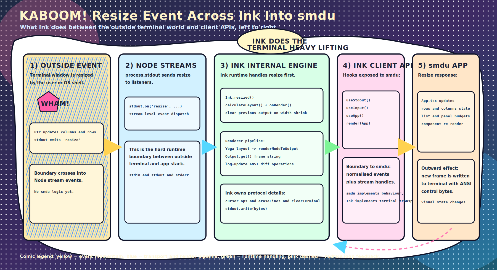
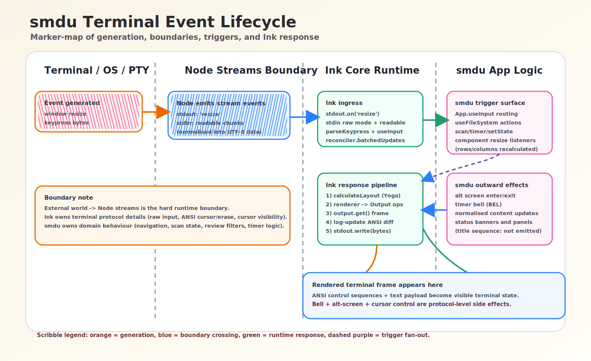
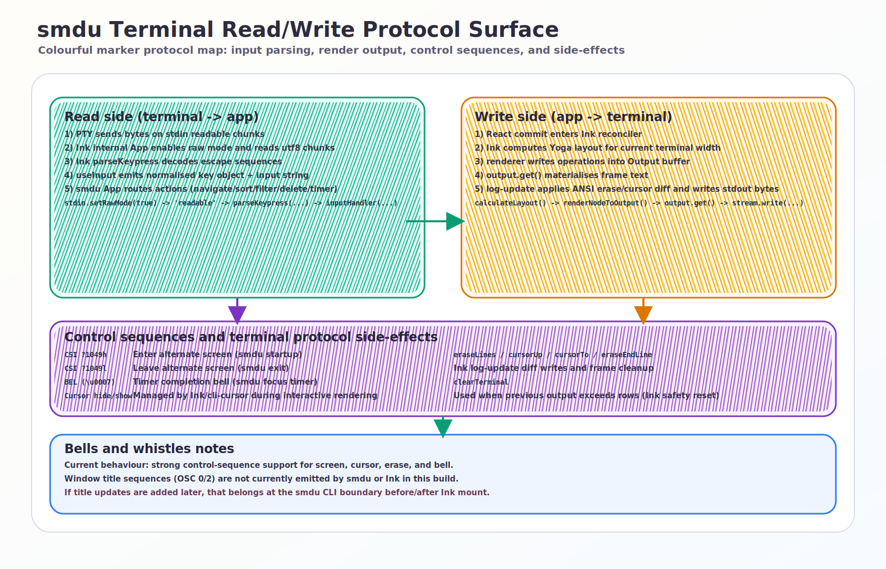
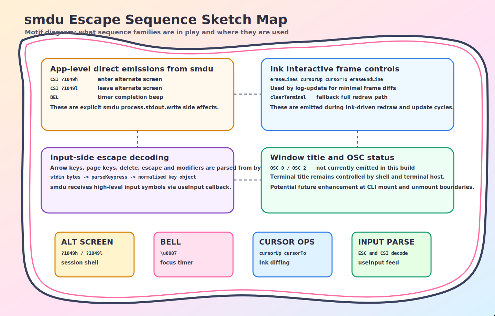

# smdu Terminal I/O and Event Model

This document is a dedicated deep dive into terminal interaction design for `smdu`: how events are generated, where they enter Ink, where the `smdu` boundary lives, what each event triggers, and how bytes are written back to the terminal.

## Scope

This is the detailed companion to `smdu_architecture_deconstruction.md` and focuses specifically on:

- terminal input ingestion (`stdin`, raw mode, keypress decoding)
- resize/event propagation
- Ink render/write pipeline
- terminal protocol side-effects (control sequences, cursor, bell)
- practical behaviour for bells and whistles (including title handling)

## Visual Overview

[Open SVG: resize event comic flow](./images/smdu_resize_event_comic_flow.svg)

[](./images/smdu_resize_event_comic_flow.svg)

[Open SVG: smdu terminal event lifecycle](./images/smdu_terminal_event_lifecycle.svg)

[](./images/smdu_terminal_event_lifecycle.svg)

[Open SVG: smdu terminal protocol surface](./images/smdu_terminal_protocol_surface.svg)

[](./images/smdu_terminal_protocol_surface.svg)

## Concept Motifs

These extra diagrams are playful companions that express the same runtime ideas through visual metaphors.

[Open SVG: smdu event constellation](./images/smdu_terminal_event_constellation.svg)

[](./images/smdu_terminal_event_constellation.svg)

[Open SVG: smdu escape sequence sketch map](./images/smdu_terminal_escape_sequence_map.svg)

[](./images/smdu_terminal_escape_sequence_map.svg)

## Prompt Gallery

Prompt references for these SVGs are tracked in:

- `docs/architecture/smdu_svg_prompt_gallery.md`

## 1) Runtime boundaries

`smdu` runs in one process, but there are clear runtime boundaries:

1. **Terminal/PTY boundary**
   - External world: terminal emulator, OS, PTY driver
   - Boundary object: Node streams/events (`stdin`, `stdout`)
2. **Ink runtime boundary**
   - Ink owns terminal protocol mechanics (raw input, key decoding, cursor, ANSI diff writes)
3. **smdu app boundary**
   - `smdu` owns domain behaviour (scan state, navigation, review logic, timer behaviour, overlays)

## 2) Event generation and ingress

### 2.1 Terminal resize

Generation path:

1. User resizes terminal window.
2. PTY dimension change updates stream dimensions.
3. `stdout` emits `resize`.

Ingress points:

- Ink listens directly to `stdout.on('resize', ...)` and runs internal resize handling.
- `smdu` also listens (via `useStdout`) in `App` and in size-sensitive components.

### 2.2 Keyboard input

Generation path:

1. User presses a key.
2. Terminal sends raw bytes to `stdin`.
3. Ink internal App reads chunks in raw mode and emits input events.
4. Ink `useInput` parses escape sequences into a normalised key object.
5. `smdu` `useInput` callback receives `(input, key)` and routes actions.

### 2.3 Internal asynchronous events

- Scan progress and partial tree updates come from `scanDirectory` callbacks.
- Timer ticks come from interval callbacks.
- File metadata/delete completions come from Promise resolution.

## 3) Read path details (terminal -> smdu)

```text
Terminal bytes
-> stdin readable chunks (raw mode)
-> Ink internal event emitter
-> parseKeypress + useInput normalisation
-> smdu App.useInput routing
-> useState/useFileSystem updates
```

Key design point: `smdu` does not parse raw terminal escape sequences itself; Ink performs that normalisation first.

### 3.1 Input routing behaviour in smdu

`App.tsx` applies strict input precedence to prevent collisions:

1. modal close paths first
2. loading/scanning guard paths
3. settings/confirm-delete gates
4. navigation and mode-specific action handling

That precedence is the app-level policy layer on top of Ink’s normalised input stream.

## 4) Write path details (smdu -> terminal)

```text
smdu state mutation
-> React commit
-> Ink reconciler resetAfterCommit
-> Yoga layout
-> renderer traverses Ink nodes
-> Output buffer operations
-> frame materialisation
-> log-update ANSI diff write
-> terminal updates on screen
```

### 4.1 Ink write responsibilities

For each response cycle, Ink performs:

1. reconcile and commit terminal component tree
2. compute layout with Yoga at current terminal width
3. convert component tree to positioned text operations
4. flatten operations into a full frame
5. minimise terminal churn with ANSI line-diff updates
6. manage cursor visibility and redraw correctness

### 4.2 Resize-specific write behaviour

On width shrink, Ink clears prior output before rendering next frame to avoid overlap artefacts.

## 5) Control sequence and side-effect catalogue

This section captures outward terminal protocol effects used today.

### 5.1 smdu-emitted sequences

- `CSI ?1049h` (`\u001b[?1049h`): enter alternate screen on startup (TTY + fullscreen path)
- `CSI ?1049l` (`\u001b[?1049l`): leave alternate screen on exit
- `BEL` (`\u0007`): timer completion bell

### 5.2 Ink-emitted protocol effects

- Cursor visibility toggles through `cli-cursor` (hide during interaction, show on teardown)
- ANSI erase/cursor movement operations through `log-update`:
  - `eraseLines`
  - `cursorUp`
  - `cursorTo`
  - `cursorNextLine`
  - `eraseEndLine`
- Full terminal reset path via `clearTerminal` in edge redraw cases

### 5.3 Window title behaviour

Current state in this build:

- No window title control sequence (for example `OSC 0` / `OSC 2`) is emitted by `smdu` or Ink in the current runtime path.

Implication:

- Title bar remains managed by the terminal host and shell context.

## 6) End-to-end traces

### 6.1 Resize trace

1. `stdout` resize event fires.
2. Ink recalculates layout and re-renders.
3. `smdu` updates local row/column state for layout-sensitive components.
4. React commit triggers Ink frame rebuild.
5. Ink writes ANSI diff to `stdout`.

### 6.2 Keypress trace

1. `stdin` readable chunk arrives in Ink raw mode.
2. Ink parses key metadata and calls `useInput` handlers.
3. `smdu` input router maps command to domain action.
4. Domain state updates (selection/view/filter/etc.).
5. Ink rebuilds and writes updated frame.

### 6.3 Timer completion trace

1. Interval tick sets timer state to completed.
2. `smdu` optionally emits BEL (`\u0007`).
3. Status indicator re-renders through normal Ink output path.

## 7) Practical design implications

- **Separation of concerns**: Ink handles terminal protocol complexity; `smdu` handles domain behaviour.
- **Dual resize handling is intentional**: Ink recomputes root layout, while `smdu` refines component-level budgets.
- **Protocol safety**: dynamic paths should continue to pass display strings through existing sanitisation utilities where appropriate.
- **Title support is a feature opportunity**: if added later, place it at CLI mount/unmount boundaries with explicit opt-in.

## 8) Source pointers

Primary implementation sources:

- `src/cli.tsx`
- `src/App.tsx`
- `src/state.ts`
- `node_modules/ink/build/render.js`
- `node_modules/ink/build/ink.js`
- `node_modules/ink/build/reconciler.js`
- `node_modules/ink/build/components/App.js`
- `node_modules/ink/build/hooks/use-input.js`
- `node_modules/ink/build/parse-keypress.js`
- `node_modules/ink/build/renderer.js`
- `node_modules/ink/build/render-node-to-output.js`
- `node_modules/ink/build/output.js`
- `node_modules/ink/build/log-update.js`
